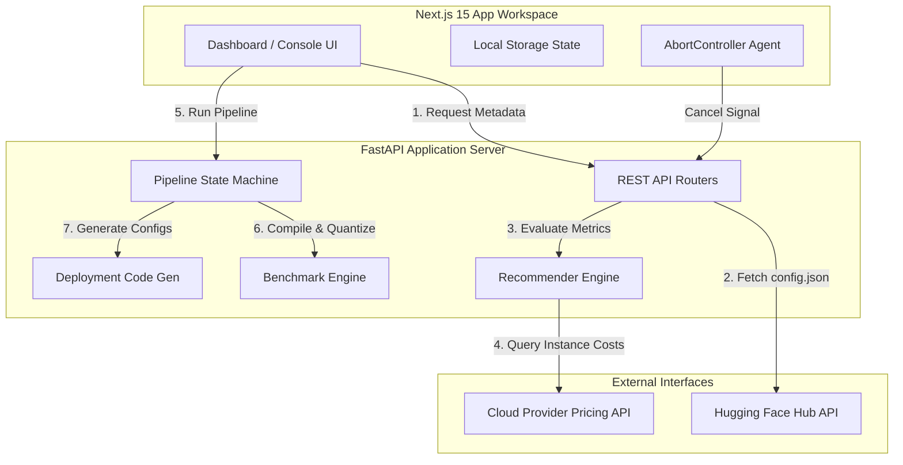

# OptiMind AI

**Author:** NIMALAN MANI M

## 📝 Short Description

**OptiMind AI** is an agentic developer platform built to inspect, profile, recommend, optimize, and package Machine Learning models for high-performance deployment on modern Arm-based Cloud CPU architectures (such as **AWS Graviton**, **Microsoft Cobalt 100**, and **Google Cloud Axion**). 

The platform bridges the gap between raw models on Hugging Face and optimized, containerized deployment pipelines using lightweight metadata parsing, heuristic recommendation algorithms, dynamic model-aware benchmarking, and 1-click cloud orchestration generation.

---

## 🚀 Features

* **Zero-Lag Model Discovery**: Search and load any public or gated Hugging Face repository instantly using lazy-loaded metadata (downloading only the `<2KB` `config.json` header).
* **AI Recommendation Heuristics**: Automatically recommends the optimal runtime engine (ONNX Runtime, Llama.cpp) and cloud instance types based on estimated model memory footprints.
* **Deterministic Benchmarking**: Computes realistic estimates for latency speedups, throughput (Tokens/sec), RAM utilization, and hosting costs.
* **Multi-Stage Optimization Pipeline**: A sequential compiler state machine that quantizes weights (INT4/INT8), exports formats, packages deployment scripts, and generates executive audits.
* **Pipeline Control**: Real-time optimization progress dashboard with an active connection `Cancel` mechanism using `AbortController` to abort operations gracefully.
* **Enterprise Cloud Deployment Packs**: 1-click generation of custom Dockerfiles, Docker Compose files, Nginx reverse proxy configurations, and Kubernetes YAML manifests.

---

## 🏗️ Architecture Diagram



---

## 📂 Repository Layout

```text
├── backend/
│   ├── app/
│   │   ├── api/                # REST endpoints (pipeline execution, report generation, system health)
│   │   ├── benchmark/          # Performance suites (latency, throughput, memory measurement models)
│   │   ├── deployment/         # Template generators (Dockerfile, Docker Compose, Kubernetes, Nginx configuration)
│   │   ├── download/           # HF Hub Downloader (fast-metadata and complete weights downloads)
│   │   ├── hardware/           # Hardware profile detectors (ARM architecture, OS, RAM features)
│   │   ├── pipeline/           # State Machine execution (stages: download, inspect, recommend, optimize, benchmark, deploy, report)
│   │   ├── recommendation/     # AI Recommenders (heuristic models matching parameters to runtime and cloud instances)
│   │   ├── reports/            # PDF and HTML report generators (charts, cost summaries)
│   │   ├── services/           # Shared backend services (Download, Recommendation, Pipeline coordinators)
│   │   └── main.py             # FastAPI App router configuration
│   └── requirements.txt        # Backend dependencies
├── frontend/
│   ├── public/                 # Static assets (site logo, SVGs)
│   ├── src/
│   │   ├── app/                # Next.js 15 pages and app router layout
│   │   │   ├── workspace/      # Optimization Workspace (Model selection, Pipeline console, Benchmark tables, Reports view)
│   │   │   ├── history/        # Previous optimization logs and audit trails
│   │   │   ├── about/          # Platform specs & versions
│   │   │   ├── globals.css     # Global styles & tailwind themes
│   │   │   └── layout.tsx      # Main layout component (Navbar and view containers)
│   │   ├── components/         # Reusable layouts and custom views
│   │   │   ├── layout/         # Shared structure (Navbar, Sidebar)
│   │   │   └── ui/             # Pre-styled Base UI elements (Shadcn cards, inputs, buttons, tables)
│   │   └── services/           # Axios/Fetch API client hooks
│   ├── package.json            # Frontend dependencies
│   └── tsconfig.json           # TypeScript configuration
└── .gitignore                  # Monorepo build and binary exclusion file
```

---

## 🔍 How It Works

### 1. Fast Metadata Acquisition
When you input a Hugging Face model repository (e.g., `meta-llama/Llama-3.2-3B-Instruct`), the API calls `DownloadService.download_config_only`. This retrieves *only* the `config.json` header metadata, preventing gigabytes of weights from downloading during the exploration phase. The parser extracts core model settings (architecture type, attention heads, number of layers) to calculate the estimated parameters.

### 2. Heuristic Backend & VM Matching
* **Engine Selection**: Encoder models (e.g. BERT classification) are assigned the **ONNX Runtime** compilation backend. Decoder models (e.g. LLM text generation) are assigned the **Llama.cpp** (GGUF) framework.
* **VM Sizing**: Small models (<4B params) are matched with 4-core, 16GB Arm VMs (AWS `c8g.large`, GCP `t2a-standard-4`, Azure `Standard_D4ps_v6`). Medium models (4B-8B params) scale to 8-core instances.
* **Costing**: Establishes run-rates using current regional cloud billing metrics, displaying potential cost reductions compared to traditional x86 workloads.

### 3. Pipeline State Machine
Upon activation, the pipeline runs sequentially through stages:
1. **DownloadStage**: Downloads full model weights (safetensors). If the model is restricted/gated or download fails, it gracefully transitions to simulated optimization mode to prevent pipeline failure.
2. **InspectionStage**: Audits structural details.
3. **RecommendationStage**: Computes cloud and runtime matching.
4. **OptimizationStage**: Converts representation formats and applies dynamic INT4/INT8 quantization passes.
5. **BenchmarkStage**: Runs profiling tasks comparing optimized vs. original metrics.
6. **DeploymentStage**: Assembles cloud and container deployment packs.
7. **ReportStage**: Commits analytics to PDF and HTML format.

---

## 🛠️ Tech Stack

* **Frontend**: Next.js 15 (App Router), TypeScript, React, Tailwind CSS, Lucide icons, Radix UI.
* **Backend**: FastAPI (Python 3.13), Uvicorn, Hugging Face Hub Client, Optimum API, Pydantic, ReportLab.

---

## ⚙️ Installation

### Prerequisites
* **Node.js** (v18 or higher)
* **Python** (v3.10 - v3.13)

### Setup Steps
1. Clone the repository:
   ```bash
   git clone https://github.com/Nimalan07/optimind-ai.git
   cd optimind-ai
   ```
2. Set up the Python virtual environment:
   ```bash
   cd backend
   python -m venv venv
   # Windows:
   .\venv\Scripts\activate
   # macOS/Linux:
   source venv/bin/activate
   ```
3. Install backend dependencies:
   ```bash
   pip install -r requirements.txt
   ```
4. Install frontend dependencies:
   ```bash
   cd ../frontend
   npm install
   ```

---

## 💡 Usage

1. **Start the Backend server**:
   ```bash
   cd backend
   uvicorn app.main:app --reload
   ```
   *FastAPI will run at `http://127.0.0.1:8000`.*
2. **Start the Frontend client**:
   ```bash
   cd frontend
   npm run dev
   ```
   *Next.js will run at `http://localhost:3000`.*
3. **Optimize a Model**:
   * Navigate to `http://localhost:3000/workspace`.
   * Input any Hugging Face model repository and click **Inspect**.
   * Review recommended hardware, estimated hosting cost, and optimization scores.
   * Click **Start Optimization**.
   * View live pipeline stages in the console UI (or click **Cancel Optimization** to abort the run).
   * Review benchmark comparison charts and download your **PDF Report** or **Deployment Package**.

### 🐳 Production Deployment (Docker Compose)
For production environments, you can run the entire platform (Frontend + Backend) inside containers:
1. Ensure **Docker** and **Docker Compose** are installed.
2. Build and start the services in detached mode:
   ```bash
   docker-compose up --build -d
   ```
3. Access the services:
   * **Frontend UI**: `http://localhost:3000`
   * **Backend API**: `http://localhost:8000`
4. To stop the services:
   ```bash
   docker-compose down
   ```

---

## 📡 API Reference

### System
* `GET /`: Returns root welcome message and API version.
* `GET /health`: Returns service health status.

### Recommendations
* `POST /recommend/{model_id}`: Fetches `config.json` metadata, inspects the architecture, and returns recommended runtime configurations, cloud instance details, hosting costs, and estimated scores.

### Pipeline
* `POST /pipeline/run/{model_id}`: Triggers the multi-stage pipeline. Run is fully stateful and tracked. Supports cancellation signals via client connection drop.

### Artifacts & Reports
* `GET /reports/{report_id}/download`: Serves generated PDF reports.
* `GET /deployment/download/{job_id}`: Serves packaged `.zip` deployment archives containing Dockerfiles and Kubernetes manifests.

---


## 🗺️ Roadmap

- [ ] Support additional compiler runtimes (TensorRT-LLM, ExecuTorch).
- [ ] Implement support for multi-GPU cloud instance clustering recommendations.
- [ ] Connect with local physical hardware profiling agents (e.g. Raspberry Pi clusters, on-prem ARM nodes).
- [ ] Add global multi-region cloud pricing trackers for live spot-instance cost mitigation.

---

## 📄 License

This project is licensed under the MIT License - see the [LICENSE](LICENSE) file for details.


