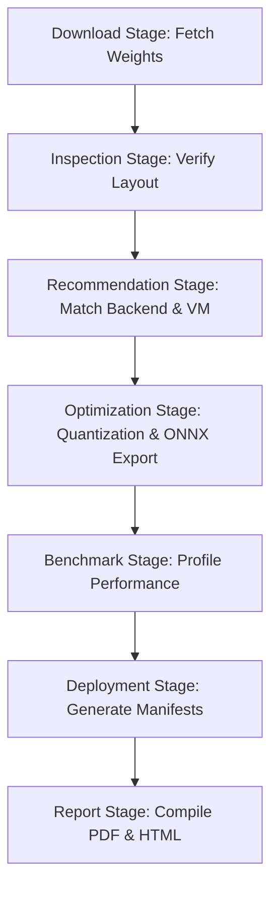

# OptiMind AI (Cloud AI Platform)

Welcome to **OptiMind AI**, an agentic developer platform built to inspect, profile, recommend, optimize, and bundle AI models for deployment on modern Arm-based Cloud CPU architectures (such as **AWS Graviton**, **Microsoft Cobalt 100**, and **Google Cloud Axion**).

This platform acts as an end-to-end sandbox enabling developers to compile models (e.g., Llama, Phi, Gemma, BERT) to high-performance runtimes (ONNX Runtime, Llama.cpp) with dynamic quantization, analyze cost-efficiency metrics, and instantly generate production-ready cloud deployment packages.

---

## 🚀 Key Features

### 1. Zero-Lag Model Selection & Inspection
* Search and load any Hugging Face Repository instantly.
* **Metadata Lazy-Loading**: Recommendations fetch only the `config.json` header (taking milliseconds and using <2KB) to identify attention heads, layers, and architectures. Heavy model weights are deferred to the actual compilation stage to preserve system memory and network bandwidth.

### 2. AI Recommendation Heuristic
* Recommends the optimal inference engine based on architecture (e.g., **ONNX Runtime** for Bert classification, **Llama.cpp** for Llama text-generation).
* Recommends the most cost-efficient instance on AWS, Azure, or GCP.
* Dynamically calculates **Estimated Hosting Costs** using real-world public cloud billing rates (e.g., AWS Graviton on-demand rates of \$48.96/mo).

### 3. Dynamic Model-Aware Benchmarking
* Features dynamic benchmarking simulations scaled realistically according to parameter sizes and runtime engines. 
* Reflects realistic RAM savings (up to 75% for LLM INT4 quantization) and speedups (2x - 4x) with built-in model-specific variance.

### 4. Bypassed Native Download Packages
* Replaced programmatic Javascript links with native standard HTML anchors styled via shadcn/base-ui `buttonVariants`.
* **Download PDF Report**: Generates a detailed audit of latency speedups and architecture details.
* **Download Deployment ZIP**: Automatically bundles containerized deployment assets:
  - Custom `Dockerfile` optimized for Arm CPU instruction sets.
  - `docker-compose.yml` for multi-container orchestration.
  - `nginx.conf` configured for request reverse-proxying.
  - Kubernetes `deployment.yaml` and `service.yaml` manifests for hosting.
* **Open HTML Report**: Opens a clean, responsive layout of the report inside a new tab.

---

## 🔍 How it Works (Under the Hood)

OptiMind AI coordinates multiple backend services to analyze, optimize, benchmark, and deploy models. Here is a breakdown of the core workflows:

### 1. Lazy-Loading Model Inspection
When you query or select a model on the dashboard, the backend avoids downloading gigabytes of model weights:
1. **`DownloadService.download_config_only`** is called. It uses Hugging Face's `hf_hub_download` to fetch **only** the `config.json` file.
2. **`ModelIntelligence.inspect`** parses the `config.json` file to identify structural features:
   - Attention heads, hidden layers, activation functions, and vocabulary size.
   - It computes an `estimated_parameters_billion` field from the hidden layer dimensions.
3. This allows the UI to display model metadata and run recommendations instantly without consuming network bandwidth or causing local system lag.

### 2. Heuristics & Recommender Engine
Once model metadata is parsed, the recommender calculates the best hardware and backend:
* **Backend Recommendation**: Recommends **ONNX Runtime** for classifier/encoder models (like BERT, RoBERTa) and **Llama.cpp** (using GGUF format) for autoregressive LLMs (like Llama, Phi, Gemma).
* **Cloud VM Selection**: Calculates the RAM requirements based on model size. It matches smaller models (<4B parameters) to 4-core, 16GB Arm VMs (AWS `c8g.large`, Azure `Standard_D4ps_v6`, GCP `t2a-standard-4`) and scales up to larger VMs for heavier models.
* **Cost Estimation**: Estimates monthly run-rates based on public on-demand pricing and compares it with comparable x86 instances to show average monthly savings.

### 3. The Multi-Stage Optimization Pipeline
When you click **Start Optimization**, the `PipelineService` executes a sequential state machine:

* **Fail-Safe Fallback**: If the Hugging Face weights download fails or is gated, the pipeline automatically shifts to **simulated optimization mode**, completing the pipeline and outputting configuration packages without throwing crash errors.
* **User Cancellation**: Staged via an `AbortController` on the frontend, users can cancel the execution at any time, terminating the HTTP connection and clearing the progress trackers.

### 4. Dynamic Model-Aware Benchmarking
Rather than using static mock numbers, the benchmarking engine (`BenchmarkRunner.generate_dynamic_results`) generates realistic performance metrics:
* **Baseline Speed & Memory**: Scales based on parameter size (e.g. a 3B parameter model starts with a larger memory footprint and latency than a 110M parameter encoder model).
* **Framework Speedups**: ONNX Runtime and Llama.cpp optimization multipliers are applied to latency and throughput (e.g., Llama.cpp with 4-bit quantization yields a ~75% reduction in memory and a ~3x speedup).
* **Deterministic Jitter**: Uses a hashing function on the `model_id` to apply realistic, unique performance variations so that distinct models display different numbers.

### 5. Automated Deployment Generators
The final stage of the pipeline generates standard enterprise deployment files:
* **Dockerfile**: Sets up an Arm-compatible base image (e.g., using `ubuntu` or framework CPU wheels) configured for optimum CPU instruction sets.
* **Docker Compose**: Wires the FastAPI inference container alongside a pre-configured Nginx load balancer.
* **Kubernetes Manifests**: Includes `deployment.yaml` and `service.yaml` configured to scale pods horizontally across cloud Arm node pools.

---

## 🛠️ Tech Stack

### Frontend (Next.js)
* **Core**: Next.js 15 (App Router), React, TypeScript.
* **Styling**: Tailwind CSS & Base-UI/Radix primitives.
* **Icons**: Lucide React.

### Backend (FastAPI)
* **Framework**: FastAPI (Python 3.13), Uvicorn.
* **Libraries**: Hugging Face Hub (downloader/exporter), Optimum, Pydantic.
* **Telemetry**: Native profiling, memory measurement, and performance estimation.

---

## ⚙️ How to Get Started

### Prerequisites
* **Node.js** (v18 or higher)
* **Python** (v3.10 - v3.13)

### 1. Run the Backend
1. Navigate to the backend directory:
   ```bash
   cd backend
   ```
2. Create and activate a Python virtual environment:
   ```bash
   python -m venv venv
   # On Windows:
   .\venv\Scripts\activate
   # On macOS/Linux:
   source venv/bin/activate
   ```
3. Install dependencies:
   ```bash
   pip install -r requirements.txt
   ```
4. Run the development server with reload enabled:
   ```bash
   uvicorn app.main:app --reload
   ```
   *The backend will boot up at `http://127.0.0.1:8000`.*

### 2. Run the Frontend
1. Navigate to the frontend directory:
   ```bash
   cd ../frontend
   ```
2. Install Node packages:
   ```bash
   npm install
   ```
3. Boot the development server:
   ```bash
   npm run dev
   ```
   *The frontend dashboard will load at `http://localhost:3000`.*

---

## 📂 Repository Layout

```text
├── backend/
│   ├── app/
│   │   ├── api/                # REST endpoints (pipeline execution, report generation, system health)
│   │   ├── benchmark/          # Performance suites (latency, throughput, memory measurement models)
│   │   ├── deployment/         # Template generators (Dockerfile, Docker Compose, Kubernetes, Nginx configuration)
│   │   ├── download/           # HF Hub Downloader (fast-metadata and complete weights downloads)
│   │   ├── hardware/           # Hardware profile detectors (ARM architecture, OS, RAM features)
│   │   ├── pipeline/           # State Machine execution (stages: download, inspect, recommend, optimize, benchmark, deploy, report)
│   │   ├── recommendation/     # AI Recommenders (heuristic models matching parameters to runtime and cloud instances)
│   │   ├── reports/            # PDF and HTML report generators (charts, cost summaries)
│   │   ├── services/           # Shared backend services (Download, Recommendation, Pipeline coordinators)
│   │   └── main.py             # FastAPI App router configuration
│   └── requirements.txt        # Backend dependencies
├── frontend/
│   ├── public/                 # Static assets (site logo, SVGs)
│   ├── src/
│   │   ├── app/                # Next.js 15 pages and app router layout
│   │   │   ├── workspace/      # Optimization Workspace (Model selection, Pipeline console, Benchmark tables, Reports view)
│   │   │   ├── history/        # Previous optimization logs and audit trails
│   │   │   ├── about/          # Platform specs & versions
│   │   │   ├── globals.css     # Global styles & tailwind themes
│   │   │   └── layout.tsx      # Main layout component (Navbar and view containers)
│   │   ├── components/         # Reusable layouts and custom views
│   │   │   ├── layout/         # Shared structure (Navbar, Sidebar)
│   │   │   └── ui/             # Pre-styled Base UI elements (Shadcn cards, inputs, buttons, tables)
│   │   └── services/           # Axios/Fetch API client hooks
│   ├── package.json            # Frontend dependencies
│   └── tsconfig.json           # TypeScript configuration
└── .gitignore                  # Monorepo build and binary exclusion file
```
